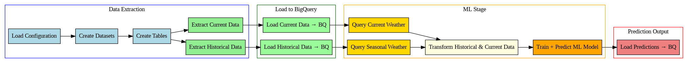

# 🌦️ Weather Forecasting ELT Pipeline

This project implements a **modular, scalable end-to-end ELT (Extract, Load, Transform)** pipeline for **weather forecasting** using **Google Colab Python** and **Google Cloud Platform (BigQuery)**. It automates the process of collecting, storing, transforming, and modeling weather data to predict **hourly temperatures** in **Siegburg, Germany**.

The weather forecasting is at this stage in a simplified form to represent the function of the pipeline. In future, there may be a deeper focus on more complex machine learning models, but for now, it serves the purpose of demonstrating a **reproducible data engineering workflow**.  
Data is sourced from the **[Open-Meteo API](https://open-meteo.com/)** and processed into a structured format to support **machine learning-based forecasting**. The pipeline is built for experimentation and can be scaled with additional features like orchestration or containerization.

---

## Project Overview

The pipeline performs the following high-level steps:

1. **Extract** historical and current weather data via the [Open-Meteo API](https://open-meteo.com/).
2. **Load** this data into **Google BigQuery**, partitioned by year.
3. **Transform** and prepare the data through feature engineering.
4. **Predict** hourly temperatures using a **Random Forest** regression model.
5. **Store** the predictions back to BigQuery.

---

## Orchestration

The pipeline is orchestrated using **Prefect 3.5**, which allows each step to be defined as a **@task** and combined into a **flow**. Prefect manages **task dependencies, execution order, and monitoring**, ensuring that:

- Extraction occurs before loading into BigQuery.
- Transformation only runs once the required data is available.
- Machine learning training and predictions are executed after data preparation.
- Predictions are safely loaded into BigQuery.

This orchestration makes the pipeline **modular, reproducible, and maintainable**, while providing a clear overview of the workflow through DAG visualizations.

---

## Tools and Technologies Used

- **Google Colab**: Interactive environment for development, experimentation, and running Python code.
- **Google Cloud Platform (GCP)**: Provides the cloud infrastructure for this project, including **BigQuery** for storing and querying large weather datasets.
- **Prefect 3.5**: Orchestration framework for defining tasks and flows, managing dependencies, and visualizing the DAG.
- **Python Libraries**: `pandas`, `numpy`, `scikit-learn` for data processing and machine learning.
- **Graphviz**: Visualization library used to generate DAG diagrams of the pipeline tasks.

This combination of tools ensures an efficient, scalable, and cloud-native approach to building the weather forecasting pipeline.

For data retrieval, the project uses the **[Open-Meteo API](https://open-meteo.com/)**, which provides weather forecasts for different geographical regions.

---

## Attribution for Weather Data

This project uses weather data provided by [Open-Meteo.com](https://open-meteo.com), which is offered under the [Attribution 4.0 International (CC BY 4.0)](https://creativecommons.org/licenses/by/4.0/) license.

You are free to copy, redistribute, and adapt the data, but please ensure proper attribution:

- **Credit**: "Weather data by Open-Meteo.com"
- **Link**: [Open-Meteo.com](https://open-meteo.com)
- **Changes**: If you make changes to the data, you must indicate that modifications were made.

For more information, refer to the [Open-Meteo Terms of Service](https://open-meteo.com/en/terms).

**Example attribution (HTML for display in web or applications):**
```html
<a href="https://open-meteo.com/">
	Weather data by Open-Meteo.com
</a>
```

---

## Project Structure

```text
weather-forecasting-elt/
├── elt_pipeline_weather.ipynb           # Main notebook runner
├── gcp_utils/                           # Utilities for Google Cloud (BigQuery)
│   ├── create_dataset.py
│   ├── create_table.py
│   └── manage_gcp.py
├── weather_pipeline/                    # ELT and ML logic
│   ├── Dockerfile
│   ├── fetch_utils.py
│   ├── load.py
│   ├── load_config.py
│   ├── main.py
│   ├── predictor_utils.py
│   ├── query_utils.py
│   ├── transform_utils.py
│   ├── visualization_utils.py
├── config.yaml                          # Central configuration file
├── dag_weather_forecast_pipeline.png    # DAG visualization of the Prefect pipeline
├── requirements.txt                     # Required packages
└── README.md                            # This file
```

---

## ELT Process

This project follows a structured **ELT (Extract, Load, Transform)** workflow, fully orchestrated with **Prefect 3.5**.  
Each step is implemented as a **Prefect @task**, managed within a central **flow**, allowing for dependency control, retry policies, and clear monitoring through DAG visualization.

### 1. Extract
- Fetches historical weather data (2017–2024) and current conditions using Open-Meteo’s REST API.
- Tasks handle both **historical** and **current** API calls separately for modularity.
- Stores raw JSON responses in memory and converts them to structured Pandas DataFrames.
- Automatically retries API calls if temporary connection errors occur (managed by Prefect).

### 2. Load
- Loads raw weather data into **Google BigQuery**, storing each year’s data in a separate table.
- Data loading is orchestrated so that BigQuery tables are created before loading occurs.
- Uses the `google-cloud-bigquery` Python client for seamless integration with GCP.

### 3. Transform
- Cleans and formats raw weather data into consistent schemas.
- Performs **feature engineering** to create columns such as:
  - `temperature`, `rel_humidity`, `precipitation`, `pressure`, `wind_speed`, `wind_direction`
- Merges historical and current data to prepare model-ready features.
- Executed only after successful loading, as enforced by Prefect task dependencies.

### 4. Model (Predict)
- Trains a **Random Forest Regressor** using historical October data.
- Generates hourly temperature predictions for the current period.
- The **ML Stage** sits at the center of the DAG, connecting data transformation with prediction output.
- Prefect ensures the model only trains after all required data transformations are complete.

### 5. Store
- Saves prediction results back to BigQuery for analytics or dashboarding.
- Acts as the final task in the flow, marking successful pipeline completion.

---

### Orchestration and Visualization
The entire ELT process is orchestrated through **Prefect 3.5**, ensuring tasks execute in the correct order and enabling recovery in case of failures.  
The dependency graph of the pipeline is visualized using **Graphviz**. The following DAG shows the Prefect-orchestrated workflow of the weather forecasting pipeline:


---

## ELT Process

This project follows a structured **ELT (Extract, Load, Transform)** workflow, fully orchestrated with **Prefect 3.5**.  
Each step is implemented as a **Prefect @task**, managed within a central **flow**, allowing for dependency control, retry policies, and clear monitoring through DAG visualization.

### 1. Extract
- Fetches historical weather data (2017–2024) and current conditions using Open-Meteo’s REST API.
- Tasks handle both **historical** and **current** API calls separately for modularity.
- Stores raw JSON responses in memory and converts them to structured Pandas DataFrames.
- Automatically retries API calls if temporary connection errors occur (managed by Prefect).

### 2. Load
- Loads raw weather data into **Google BigQuery**, storing each year’s data in a separate table.
- Data loading is orchestrated so that BigQuery tables are created before loading occurs.
- Uses the `google-cloud-bigquery` Python client for seamless integration with GCP.

### 3. Transform
- Cleans and formats raw weather data into consistent schemas.
- Performs **feature engineering** to create columns such as:
  - `temperature`, `rel_humidity`, `precipitation`, `pressure`, `wind_speed`, `wind_direction`
- Merges historical and current data to prepare model-ready features.
- Executed only after successful loading, as enforced by Prefect task dependencies.

### 4. Model (Predict)
- Trains a **Random Forest Regressor** using historical October data.
- Generates hourly temperature predictions for the current period.
- The **ML Stage** sits at the center of the DAG, connecting data transformation with prediction output.
- Prefect ensures the model only trains after all required data transformations are complete.

### 5. Store
- Saves prediction results back to BigQuery for analytics or dashboarding.
- Acts as the final task in the flow, marking successful pipeline completion.

---

### Orchestration and Visualization
The entire ELT process is orchestrated through **Prefect 3.5**, ensuring tasks execute in the correct order and enabling recovery in case of failures.  
The dependency graph of the pipeline is visualized using **Graphviz**, which generates the file:

<p align="center">
  
</p>

---

## Usage Guide

### 1. Set your Google Cloud Project ID
- Before running the notebook, open `elt_pipeline_weather.ipynb` and locate the configuration dictionary.
- Replace the `project_id` value with your own Google Cloud project ID and `dataset_month` to the current month, for example:

```python
config_data = {
    "project": {
        "project_id": "your-gcp-project-id",
        "dataset_historical": "elt_weather_dataset_historical_siegburg_2017_2024",
        "table_historical": "elt_weather_table_historical_siegburg_2017",
        "dataset_month": "elt_weather_dataset_siegburg_october_2025",
        "table_8h": "elt_weather_8h_table_{timestamp}",
        # ... other config values ...
    }
}
```

### 2. Run the Notebook
#### Execute all cells sequentially. This will:
- Fetch historical and current weather data
- Load data into BigQuery
- Run transformations and train a Random Forest model
- Store prediction results back into BigQuery

### 3. View Results
After completion, explore the predictions stored in your BigQuery dataset or extend the project with visualization tools.

---


## Key Modules

### `gcp_utils/`
- `create_dataset.py` – Create BigQuery datasets
- `create_table.py` – Create BigQuery tables
- `jobtables.py` – Submit query jobs to BigQuery
- `manage_gcp.py` – CLI runner for GCP utilities

### `weather_pipeline/`
- `fetch_utils.py` – Handle API requests and data formatting
- `load_utils.py` – Load Pandas DataFrames to BigQuery, and convert NumPy arrays to DataFrames
- `load_config.py` – Read config from YAML file
- `main.py` – Central runner script for the pipeline
- `predictor_utils.py` – Train and evaluate prediction models
- `query_utils.py` – Construct and run SQL queries
- `transform_utils.py` – Feature engineering and cleaning
- `visualization_utils.py` – Plotting and metrics

---

## Configuration

- `config.yaml`: Central configuration file for setting:
  - API parameters
  - BigQuery dataset/table names
  - ML model settings

---

## Requirements

- Python 3.7+
- Google Cloud credentials (service account with BigQuery permissions)
- Jupyter Notebook or Google Colab
- Prefect 3.5.0
- Dependencied are installed while running the whole Notebook:

```bash
!pip install -r /content/drive/MyDrive/elt_pipeline_weather_forecast/requirements.txt
```

---

## Future Work

This project is actively being expanded to improve automation, portability, and predictive capabilities:

### Orchestration
- Add workflow orchestration with **Airflow**
- Schedule regular data updates and monitor pipeline runs

### Dockerization
- Containerize the pipeline using **Docker** for reproducible environments
- Facilitate deployment across different machines or cloud platforms

### Machine Learning
- Integrate a lightweight ML component to generate **1-hour weather forecasts**
- Continuously retrain and evaluate the model as new data arrives

**Goal:**
A reproducible, automated ELT pipeline that collects, transforms, and predicts short-term weather data with minimal manual intervention.

---

## License

- This project is licensed under the [MIT License](LICENSE).
- See the LICENSE file for details.

---

## Acknowledgements

- Thanks to public weather data providers Open Meteo for API access
- Inspired by best practices in ELT pipeline design and reproducible data science
